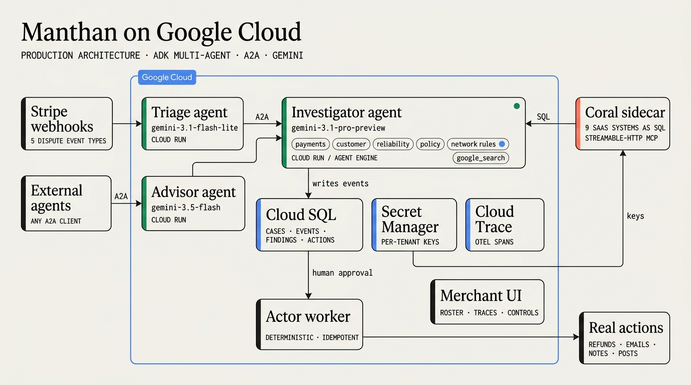
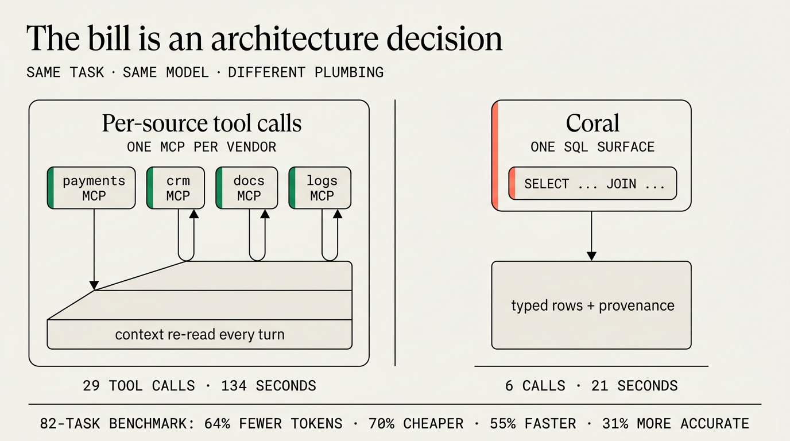
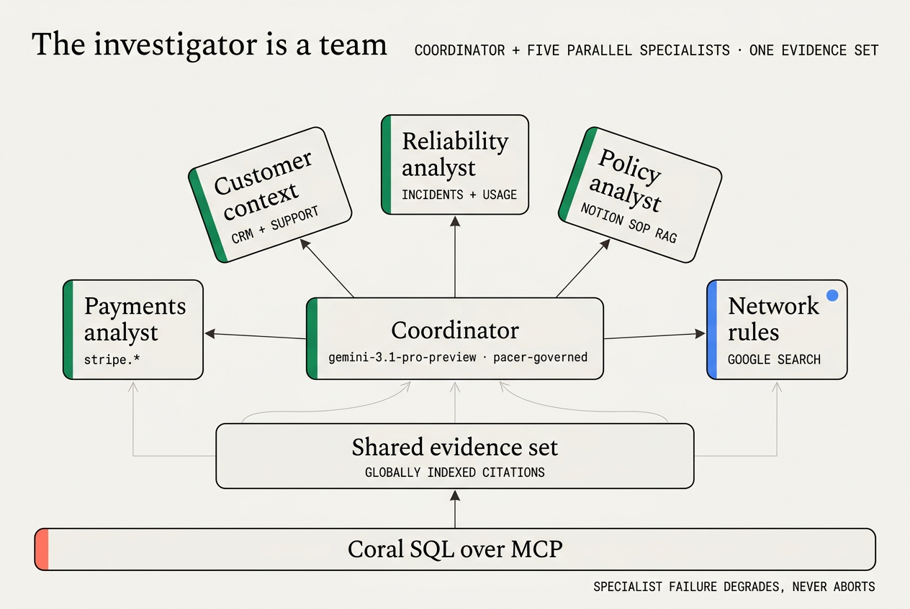
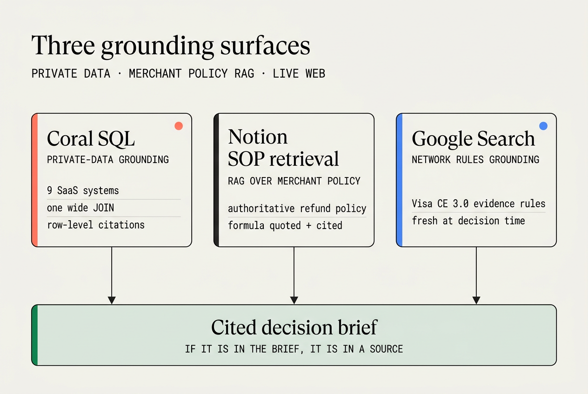
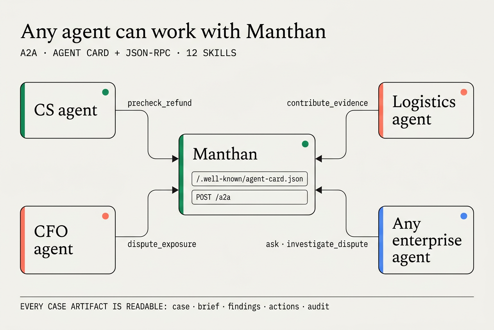

<p align="center">
  
</p>

<h3 align="center">Manthan</h3>

<p align="center">
  The autonomous multi-agent investigator for B2B billing disputes.
  <br /><br />
  <strong>Track 3 submission · Google for Startups AI Agents Challenge</strong>
  <br />
  <em>Refactor for Google Cloud Marketplace & Gemini Enterprise</em>
  <br /><br />
  <a href="https://manthan-ui-dzv6bwbpba-uc.a.run.app"><strong>Live app</strong></a> ·
  <a href="https://manthan-advisor-dzv6bwbpba-uc.a.run.app/.well-known/agent-card.json"><strong>Live agent card</strong></a>
</p>

<p align="center">
  
  
  
  
  <a href="https://github.com/Miny-Labs/manthan/blob/main/LICENSE"></a>
</p>

<p align="center">
  <a href="#track-3-compliance-map"><strong>Compliance map</strong></a> ·
  <a href="#coral--the-retrieval-layer"><strong>Coral</strong></a> ·
  <a href="#the-business-case"><strong>Business case</strong></a> ·
  <a href="#a-multi-agent-system-not-a-chatbot"><strong>Multi-agent</strong></a> ·
  <a href="#grounding--rag"><strong>Grounding & RAG</strong></a> ·
  <a href="#a2a-interoperability"><strong>A2A</strong></a> ·
  <a href="#governed-by-design"><strong>Governance</strong></a> ·
  <a href="#quick-start"><strong>Quick start</strong></a> ·
  <a href="#deploy-on-google-cloud"><strong>Deploy</strong></a>
</p>

https://github.com/user-attachments/assets/afa2105c-3cc1-40e2-a799-6fcd2ee2f3f8

<p align="center">
  
</p>

## What this is

Billing disputes come in many shapes — a chargeback, a refund demand, a failed payment, an early fraud warning, a contested invoice — and in every one of them the truth is scattered: the charge lives in Stripe, the account in the CRM, the complaint in the support desk, the outage that triggered it in observability, the refund formula in the policy docs. Someone has to read all of it, apply the documented policy, compute what's actually owed, and respond before the clock runs out. A senior analyst spends ~5 hours per dispute doing exactly that — or the merchant eats the loss.

Manthan is that analyst, rebuilt as a team of agents that finishes in ~3 minutes:

- The **triage agent** receives the Stripe dispute (or an `investigate_dispute` call from another agent), frames the case, and dispatches the investigator over A2A.
- The **investigator agent** — a coordinator commanding **five specialists in parallel** — reads across nine business systems via [Coral](https://github.com/withcoral/coral) SQL and writes a decision brief: **fight, refund, accept, or escalate**, with the math shown and every claim cited to the source record it came from.
- The agent only ever *proposes*. A **policy engine** routes each decision to its human approval tier, and a **deterministic actor** executes the approved actions — refund, dispute response, customer email — with idempotency keys. The LLM never holds write credentials.
- The **advisor agent** answers questions about any case — for operators, and for other agents over A2A.

## Track 3 compliance map

| Mandate | Implementation | Where |
|---|---|---|
| **B2B focus** | Billing-dispute resolution for B2B SaaS merchants — chargebacks, refund demands, failed payments, fraud warnings | [Business case](#the-business-case) |
| **Cloud-native runtime** | Six Cloud Run services + Cloud SQL + Secret Manager; Agent Engine documented for the investigator | [`deploy/gcp/`](./deploy/gcp) |
| **Gemini-powered intelligence** | All reasoning on Gemini: 3.1-pro (coordinator) · 3.5-flash (specialists, advisor) · 3.1-flash-lite (triage, prettifier) | [`agent/.../config.py`](./agent/src/manthan_agent/config.py) |
| **A2A interoperability** | Three Agent Cards, JSON-RPC `/a2a`, triage→investigator over A2A, 12 skills for external agents | [`agent/.../a2a/`](./agent/src/manthan_agent/a2a) |
| **Multi-agent ADK orchestration** | Coordinator + five parallel specialists (shared Evidence set); triage / investigator / advisor as identified macro agents | [`agent/.../team.py`](./agent/src/manthan_agent/team.py) |
| **Grounding + RAG** | Private data via Coral SQL · RAG over merchant policy docs · `google_search` for card-network rules | [Grounding & RAG](#grounding--rag) |
| **Agent Identity** | One service account per agent; identity block on every Agent Card; rendered in the Agent Roster | [`deploy/gcp/deploy.sh`](./deploy/gcp/deploy.sh) |
| **Collaboration > single agent** | Scoped parallel specialists; failures degrade, never abort; external agents join cases over A2A | [Multi-agent](#a-multi-agent-system-not-a-chatbot) |

## Coral — the retrieval layer

Dispute facts live in nine systems of record: the charge in Stripe, the account in the CRM, the complaint in support, the outage in observability, the refund formula in the policy docs. [**Coral**](https://github.com/withcoral/coral) (Apache-2.0, Rust) exposes them as **Postgres-compatible SQL schemas behind one MCP server** — retrieval becomes a query plan instead of per-vendor tool calls stitched together in the model's context:

```sql
SELECT
  d.id AS dispute_id, d.amount, d.reason, d.evidence_due_by,
  c.email AS customer_email,
  (SELECT COUNT(*) FROM stripe.disputes
     WHERE customer = d.customer AND id <> d.id)            AS prior_disputes,
  (SELECT COUNT(*) FROM intercom.conversations
     WHERE source_author_email = c.email)                   AS support_threads,
  (SELECT COUNT(*) FROM datadog.incidents
     WHERE service = 'custom-reports-svc'
       AND window @> tstzrange(ch.created, ch.created + interval '7 days'))
                                                            AS incidents_in_window,
  (SELECT body FROM notion.pages
     WHERE title ILIKE '%pro-rata credit%' AND active)      AS policy_body
FROM stripe.disputes d
JOIN stripe.charges   ch ON ch.id = d.charge_id
JOIN stripe.customers c  ON c.id  = d.customer
WHERE d.id = 'dp_aperture_345478';
```

One query, one round-trip, one rowset. Why it's the right grounding layer:

- **Live system-of-record data** — queried at decision time, not embeddings of a stale copy. No ETL, no index drift.
- **Structural provenance** — every row carries source/table/record id; row-level citations are free and clickable.
- **Joins beat tool-call chains** — cross-system correlation happens in the query engine, not in the context window.
- **The provider is a slot** — 170+ adapters upstream, nine connected here. HubSpot *or* Salesforce, Intercom *or* Zendesk, Notion *or* Confluence: same SQL surface, discovered from the catalog at run time.
- **Read-only by design** — the retrieval plane cannot write; actions go through the actor after approval.
- **Credentials stay with Coral** — per-tenant secrets, used at query time. The model sees rows, never keys.

### The token bill is an architecture decision

<p align="center">
  
</p>

- Per-vendor MCP chains re-read the whole context every turn → **quadratic cost** (~43× a single-call estimate by step ten), plus per-vendor tool catalogs re-bought every turn and a 10–20% malformed-call retry tax.
- Coral's discipline: **one query language** · **discover-then-query** (catalog walked at case start, no schema dump in the prompt) · **typed rows** · constrained call generation (malformed calls can't be produced).
- Coral's published 82-task benchmark vs direct vendor MCPs: **31% more accurate · 64% fewer tokens · 70% cheaper · 55% faster**. Worked example: 29 tool calls / 134 s via vendor MCPs → 1 query, 6 calls / 21 s via Coral.

Same data, same model — the architecture decides the bill. The coordinator and the four data specialists share one Coral MCP session (`coral_sql`, `coral_list_catalog`, `coral_describe_table`); every query is recorded as an event and visible as raw SQL in the Workspace's Coral mode.

## The business case

Disputes arrive with deadlines, evidence requirements vary by network and reason code, and the facts span payments, CRM, support, observability, and policy docs. Teams either eat the loss or burn analyst hours reconstructing what happened.

Manthan returns one of four decisions — **fight** (network-compliant evidence) · **refund** (correctly-computed amount, including partial pro-rata credits) · **accept** · **escalate** (tradeoff named) — gated by policy (auto < $50 · one-click $50–500 · two-person $500+), with a full audit trail.

As buyers become agents (AP2), disputes become agent-to-agent conversations — Manthan's A2A surface is the merchant's side of that conversation.

## A multi-agent system, not a chatbot

<p align="center">
  
</p>

- **Scoped specialists, run in parallel** — payments thinks in `stripe.*` joins, reliability correlates incidents with the disputed window, policy retrieves the authoritative SOP. Wall-clock ≈ the slowest specialist, not the sum.
- **One shared Evidence set** — specialists write into it; the coordinator's citations stay globally indexed.
- **An honest boundary** — ADK's built-in `google_search` can't mix with function tools, so the network-rules analyst is necessarily its own agent.
- **Failures degrade, never abort** — `ResilientAgentTool` caps each specialist at 180 s; a 503-storm or hung connection becomes an error result the coordinator routes around.
- **Governed reasoning** — the pacer (pure rules as ADK `before_model` / `before_tool` callbacks) nudges drift and refuses to finalize a refund whose math no finding shows. It rejected the first `conclude()` in the validation run.

<details>
<summary><strong>Full topology (text)</strong> — every service, gate, and adapter</summary>

```
   │ Stripe webhooks (5 event types)          │ A2A (external agents)
   │ dispute · fraud-warning · payment        │ message/send · tasks/get
   ▼                                          ▼
┌────────────────┐  A2A investigate_dispute ┌─────────────────────────────────┐
│  triage agent  │ ───────────────────────▶ │  investigator agent             │
│ flash-lite ·   │  (in-process fallback    │  gemini-3.1-pro-preview         │
│ per-org slug   │   in local dev)          │  coordinator + 5 parallel       │
└────────────────┘                          │  specialists, one Evidence set: │
                                            │   · payments_analyst            │
┌────────────────┐                          │   · customer_context            │
│ advisor agent  │                          │   · reliability_analyst         │
│ gemini-3.5-    │                          │   · policy_analyst (SOP RAG)    │
│ flash · ask /  │                          │   · network_rules_analyst       │
│ precheck_refund│                          │     (google_search grounding)   │
│ / history /    │                          │  pacer rules as ADK callbacks   │
│ exposure /     │                          └──────────┬──────────────────────┘
│ contribute +   │                                     │ Coral SQL over MCP
│ 6 reads        │                          ┌──────────▼──────────┐
└──────┬─────────┘                          │  Coral (mcp-stdio)  │
       │ per-case operator chat             │  9 SaaS schemas as  │
       │ lands as agent_reply               │  pg-SQL (read-only) │
       │                                    └─────────────────────┘
       │        both write through services/case_store.py
       ▼                                               ▼
┌────────────────────────────────────────────────────────────────┐
│   manthan-api · FastAPI + asyncpg · PostgreSQL                 │
│   • cases / events / findings / actions  (per-org PG schema)   │
│   • per-Clerk-user workspace isolation                         │
│   • SSE streams: /api/inbox/stream, /api/cases/:id/stream      │
│   • A2A: /.well-known/agent-card.json + JSON-RPC /a2a          │
└──────────────────────────┬─────────────────────────────────────┘
                           │ approved actions
                           │ (policy gates: auto <$50 ·
                           │  one-click $50-500 · two-person $500+)
                           ▼
              ┌──────────────────────┐      ┌──────────────────────┐
              │  workers/main.py     │ ───▶ │  Action adapters     │
              │  actor + prettifier  │      │  • Stripe · refunds  │
              │  (deterministic -    │      │  • Stripe · disputes │
              │   the only workers)  │      │  • Resend · emails   │
              └──────────────────────┘      │  • HubSpot · notes   │
                                            │  • Slack  · posts    │
                                            │  • Notion · blocks   │
                                            └──────────────────────┘
```

</details>

## Grounding & RAG

<p align="center">
  
</p>

| Surface | What | How |
|---|---|---|
| **Private data — Coral** | Nine systems of record as one SQL surface ([above](#coral--the-retrieval-layer)) | Every query → Evidence row with provenance; findings cite Evidence indices; chips deep-link to the record |
| **RAG — merchant policy** | The policy analyst retrieves the merchant's own SOPs — Notion, Confluence, or Google Docs, discovered from the catalog | Search → page → formula; "two degraded days in a thirty-day cycle" is quoted from the merchant's policy page, not model priors |
| **Google Search — network rules** | Card-network evidence requirements (e.g. Visa CE 3.0 per reason code) via ADK's built-in `google_search` | Rules change too often to hardcode; retrieved fresh when a *fight* brief needs them |

## A2A interoperability

<p align="center">
  
</p>

Three Agent Cards (`/.well-known/agent-card.json` per service), JSON-RPC at `/a2a`, API-key security scheme. A2A is also the internal communication layer (triage → investigator). **12 skills**:

| | Skill | What another agent can do |
|---|---|---|
| **Act** | `investigate_dispute` | Open a full investigation |
| | `contribute_evidence` | Push evidence into an open case, provenance tagged with the contributor's identity |
| **Advise** | `ask` | Grounded, citation-bearing Q&A over a case or the portfolio |
| | `precheck_refund` | History + risk + approval gate *before* granting a refund |
| | `get_customer_history` | Prior disputes and outcomes by customer |
| | `dispute_exposure` | Open-exposure aggregates for finance agents |
| **Read** | `get_case` · `list_cases` · `get_brief` · `get_findings` · `get_actions` · `get_audit_trail` | Every case artifact — state is never locked in the UI |

```sh
curl -s https://manthan-advisor-dzv6bwbpba-uc.a.run.app/.well-known/agent-card.json
curl -s -X POST https://manthan-advisor-dzv6bwbpba-uc.a.run.app/a2a -H 'content-type: application/json' -d '{
  "jsonrpc": "2.0", "id": 1, "method": "message/send",
  "params": {"skill": "precheck_refund",
             "args": {"customer_ref": "billing@aperture-analytics.co", "amount_minor": 84000}}}'
```

## Governed by design

- **Agent Identity** — one service account per agent; agent id, SA, model, and signing fingerprint on every card; rendered in the Agent Roster (`/app/agents`).
- **HITL policy gates** — auto / one-click / two-person by amount and account. The agent proposes, humans approve, the deterministic actor executes with idempotency keys. The LLM never holds write credentials.
- **Honest failure** — upstream rejections are recorded as `failed` with the verbatim error; no synthesized success refs.
- **Observability** — OpenTelemetry end to end; Cloud Trace exporter; live span-tree per case (`/app/traces`); trace ids on every event.
- **Audit** — append-only event log per case, exposed over A2A (`get_audit_trail`) and in the UI.

## Quick start

### Prerequisites
- Node 20+ · `pnpm` or `npm`
- Python 3.12+ · [`uv`](https://github.com/astral-sh/uv)
- Docker (for the local Postgres)
- The [Coral binary](https://github.com/withcoral/coral) on your `PATH` (or set `CORAL_BINARY`)

### Setup
```sh
git clone https://github.com/Miny-Labs/manthan
cd manthan

# 1 · Environment - fill in GOOGLE_API_KEY (aistudio.google.com/apikey),
#                   CORAL_BINARY, STRIPE_API_KEY, HUBSPOT_ACCESS_TOKEN,
#                   SLACK_TOKEN, NOTION_API_KEY, CLERK_*
cp .env.example .env
cp manthan-api/.env.example manthan-api/.env
cp agent/.env.example agent/.env

# 2 · Database
docker compose -f manthan-api/docker-compose.yml up -d postgres

# 3 · Backend - API gateway (runs investigations in-process in local dev)
#     + deterministic workers (actor + prettifier)
cd manthan-api && uv sync
uv run uvicorn manthan_api.main:app --reload --port 8000 &
uv run python -m manthan_api.workers.main &

#     Optional - the three A2A agent services as separate processes
#     (full cloud parity; each serves its own agent card):
# uv run uvicorn manthan_api.agents.triage:app --port 8001 &
# uv run uvicorn manthan_api.agents.investigator:app --port 8002 &
# uv run uvicorn manthan_api.agents.advisor:app --port 8003 &

# 4 · Frontend
cd ../manthan-ui && npm install && npm run dev
```

Visit [http://localhost:5173](http://localhost:5173), sign in via Clerk. Fire a case with `stripe trigger charge.dispute.created` (webhook: `/webhooks/stripe/{org}`) or over A2A with the `investigate_dispute` skill. The canonical seeded case — $8,400 dispute → $560 pro-rata credit — is `du_1Tch1O…` in the test-mode Stripe account.

Tests (pure-logic, no LLM spend): `cd agent && uv run pytest` (79) · `cd manthan-api && uv run pytest` (71).

## Deploy on Google Cloud

Runbook, Dockerfiles, and scripts in [`deploy/gcp/`](./deploy/gcp):

- **Cloud Run** — six services from two images: API gateway, `manthan-triage`, `manthan-investigator`, `manthan-advisor` (each under its own service account), worker, UI.
- **Cloud SQL Postgres** — five migrations via `sql-migrate.sh`.
- **Secret Manager** — per-tenant `coral-{tenant}-{credential}` secrets, per-secret IAM, via `secrets-bootstrap.sh`.
- **Cloud Trace** — OTel spans for every model call, tool call, and specialist.
- **Vertex AI Agent Engine** — documented alternative host for the investigator (same ADK code, Vertex backend flag).
- **Coral sidecar** — Coral 0.4.2 over streamable-HTTP MCP in the cloud; local dev spawns `coral mcp-stdio` per investigation.

## How a case runs

| Stage | What happens |
|---|---|
| **1 · Trigger** | Stripe webhook (`charge.dispute.created` · `funds_withdrawn` · `closed` · `radar.early_fraud_warning.created` · `invoice.payment_failed`) hits triage — or an external agent calls `investigate_dispute` |
| **2 · Investigate** | Triage dispatches the investigator over A2A; coordinator fans out five specialists in parallel; pacer governs every round |
| **3 · Brief** | Executive memo, math shown, every number cited — written straight to Postgres by the investigator |
| **4 · Decide** | Refund / fight / accept / escalate + the drafted action set, gated by policy tier |
| **5 · Approve & act** | One click; the actor fires actions with idempotency keys; the advisor answers follow-ups |

## Tech stack

| Role | Model |
|---|---|
| Investigator coordinator | `gemini-3.1-pro-preview` |
| Specialists + advisor | `gemini-3.5-flash` |
| Triage + prettifier | `gemini-3.1-flash-lite` |
| Action execution (actor) | deterministic — no model |

All Gemini via AI Studio (`GOOGLE_API_KEY`).

- **Agent** — [Google ADK](https://google.github.io/adk-docs/) 2.x: coordinator + five specialists as AgentTools over one Evidence set; coral tools (read) + `record_finding` / `ask_human` / `conclude` (coordinator-only); pacer as callbacks; OpenTelemetry throughout. Details: [`agent/README.md`](./agent/README.md).
- **Backend** — FastAPI + asyncpg + PostgreSQL; three A2A agent services + two deterministic workers (`FOR UPDATE SKIP LOCKED`).
- **Frontend** — React 19 + Vite + TypeScript, Tailwind v4, Clerk auth; observability pages: Roster (`/app/agents`), Traces (`/app/traces`), Controls (`/app/controls`).
- **Data plane** — Coral: Rust binary, 9 SaaS schemas as Postgres SQL over MCP.
- **Write adapters** (actor-only, post-approval) — Stripe refunds + dispute evidence, Resend emails, HubSpot notes, Slack posts, Notion blocks.

## Repo map

| Path | Contents |
|---|---|
| [`agent/`](./agent) | ADK multi-agent brain + A2A protocol layer (cards, dispatch, client, store) |
| [`manthan-api/`](./manthan-api) | API gateway, three agent services, case store, policy engine, actor |
| [`manthan-ui/`](./manthan-ui) | Merchant product + agent observability surfaces |
| [`deploy/gcp/`](./deploy/gcp) | Cloud Run / Cloud SQL / Secret Manager runbook + scripts |

## License

Apache 2.0 — see [`LICENSE`](./LICENSE). A hosted version runs at [manthan.quest](https://manthan.quest), maintained in a separate production repository.

---

<sub>Built by <a href="https://miny-labs.com">miny-labs</a> for the Google for Startups AI Agents Challenge · Made with 🪸 Coral</sub>
