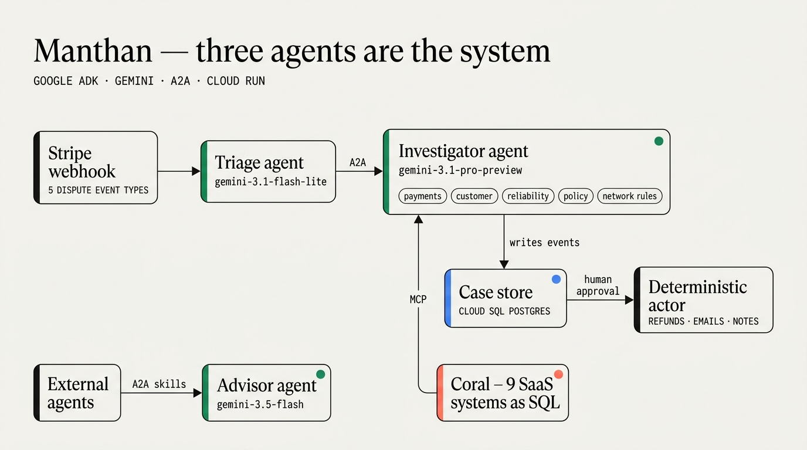

<p align="center">
  
</p>

<h3 align="center">Manthan</h3>

<p align="center">
  The autonomous multi-agent investigator for B2B billing disputes.
  <br />
  A chargeback hits Stripe → three Gemini-powered agents investigate, decide, and act — governed, cited, human-gated.
  <br /><br />
  <strong>Track 3 submission · Google for Startups AI Agents Challenge</strong>
  <br />
  <em>Refactor for Google Cloud Marketplace & Gemini Enterprise</em>
</p>

<p align="center">
  
  
  
  
  <a href="https://github.com/Miny-Labs/manthan/blob/main/LICENSE"></a>
</p>

<p align="center">
  <a href="#track-3-compliance-map"><strong>Compliance map</strong></a> ·
  <a href="#the-business-case"><strong>Business case</strong></a> ·
  <a href="#a-multi-agent-system-not-a-chatbot"><strong>Multi-agent</strong></a> ·
  <a href="#grounding--rag"><strong>Grounding & RAG</strong></a> ·
  <a href="#a2a-interoperability"><strong>A2A</strong></a> ·
  <a href="#governed-by-design"><strong>Governance</strong></a> ·
  <a href="#quick-start"><strong>Quick start</strong></a> ·
  <a href="#deploy-on-google-cloud"><strong>Deploy</strong></a>
</p>

https://github.com/user-attachments/assets/afa2105c-3cc1-40e2-a799-6fcd2ee2f3f8

<p align="center">
  
</p>

## The 30-second version

A senior analyst spends **5 hours** on a chargeback. Manthan spends **3 minutes** — and shows its work.

When a dispute hits Stripe, a **triage agent** frames the case and dispatches an **investigator agent** over A2A. The investigator's coordinator fans out **five specialist agents in parallel** across nine live business systems (via [Coral](https://github.com/withcoral/coral)'s unified SQL plane), records findings with **row-level citations**, and produces a decision brief with the refund math shown. A **policy engine** gates execution behind human approval tiers; a deterministic actor fires the approved actions against real systems. An **advisor agent** answers questions about any case — from operators, or from *other agents* over A2A.

On the seeded $8,400 dispute, live: five specialists dispatched in one parallel turn, six cited findings, and the pacer's money-mover gate **rejected the agent's first conclusion** because no finding showed the refund math — the agent derived $8,400 ÷ 30 days × 2 degraded days = **$560**, then concluded at 0.95 confidence. The correct answer, governed in real time.

## Track 3 compliance map

| Mandate | What we built | Where |
|---|---|---|
| **B2B focus** | Autonomous chargeback/dispute resolution for B2B SaaS merchants — a real money-moving back-office workflow, not a chatbot | [Business case](#the-business-case) |
| **Cloud-native runtime** | Six Cloud Run services (API gateway, 3 agent services, worker, UI) + Cloud SQL + Secret Manager; Vertex AI Agent Engine documented as the investigator's alternative host | [`deploy/gcp/`](./deploy/gcp) |
| **Gemini-powered intelligence** | Every reasoning call is Gemini: `gemini-3.1-pro-preview` (coordinator), `gemini-3.5-flash` (specialists + advisor), `gemini-3.1-flash-lite` (triage + prettifier). No other LLM anywhere | [`agent/src/manthan_agent/config.py`](./agent/src/manthan_agent/config.py) |
| **A2A interoperability** | Three agents publish Agent Cards and speak JSON-RPC A2A; triage→investigator dispatch runs over A2A; 12 skills let external agents investigate, ask, pre-check refunds, and contribute evidence | [`agent/src/manthan_agent/a2a/`](./agent/src/manthan_agent/a2a) |
| **Multi-agent ADK orchestration** | A coordinator + five parallel specialists (shared Evidence set, AgentTools) inside the investigator; triage / investigator / advisor as separately-identified macro agents | [`agent/src/manthan_agent/team.py`](./agent/src/manthan_agent/team.py) |
| **Grounding + RAG** | Private-data grounding via Coral SQL over 9 SaaS systems · RAG over merchant policy docs (Notion / Confluence / Docs — whichever the catalog shows) · ADK built-in `google_search` grounding for card-network evidence rules | [Grounding & RAG](#grounding--rag) |
| **Agent Identity** | One service account per agent; identity block (agent id, SA, model, signing fingerprint) published on every Agent Card and rendered in the product's Agent Roster | [`deploy/gcp/deploy.sh`](./deploy/gcp/deploy.sh) |
| **Collaboration > single agent** | Parallel specialists with scoped prompts + per-source schemas; specialist failures degrade instead of aborting; an external-agent skill surface a single agent could not offer | [Multi-agent](#a-multi-agent-system-not-a-chatbot) |

Judge-facing detail lives in [`docs/track3/SUBMISSION.md`](./docs/track3/SUBMISSION.md).

## The business case

Card networks gave merchants a losing game: disputes arrive with deadlines, evidence requirements vary by network and reason code, and the facts are scattered across payments, CRM, support, observability, and policy docs. Most B2B SaaS teams either eat the loss (revenue leakage) or burn analyst hours reconstructing what happened (a senior analyst, ~5 hours per chargeback).

Manthan turns that into a 3-minute, evidence-grounded decision: **fight** with network-compliant evidence, **refund** the correctly-computed amount (including partial pro-rata credits the customer is actually owed), **accept**, or **escalate** to a human with the tradeoff named. Every dollar decision is gated by policy (auto < $50 · one-click $50–500 · two-person $500+) and lands with a full audit trail.

And the forward story: as buyers become agents (AP2), disputes become agent-to-agent conversations. Manthan's A2A surface *is* the merchant's side of that conversation — a CS agent pre-checks refunds against it, a CFO agent reads exposure from it, and any enterprise agent can open or interrogate a case.

## A multi-agent system, not a chatbot

<p align="center">
  
</p>

<details>
<summary><strong>Full topology (text)</strong> — every service, gate, and adapter</summary>

```
   │ Stripe webhooks (5 event types)          │ A2A (external agents)
   │ dispute · fraud-warning · payment        │ message/send · tasks/get
   ▼                                          ▼
┌────────────────┐  A2A investigate_dispute ┌─────────────────────────────────┐
│  triage agent  │ ───────────────────────▶ │  investigator agent             │
│ flash-lite ·   │  (in-process fallback    │  gemini-3.1-pro-preview         │
│ per-org slug   │   in local dev)          │  coordinator + 5 parallel       │
└────────────────┘                          │  specialists, one Evidence set: │
                                            │   · payments_analyst            │
┌────────────────┐                          │   · customer_context            │
│ advisor agent  │                          │   · reliability_analyst         │
│ gemini-3.5-    │                          │   · policy_analyst (SOP RAG)    │
│ flash · ask /  │                          │   · network_rules_analyst       │
│ precheck_refund│                          │     (google_search grounding)   │
│ / history /    │                          │  pacer rules as ADK callbacks   │
│ exposure /     │                          └──────────┬──────────────────────┘
│ contribute +   │                                     │ Coral SQL over MCP
│ 6 reads        │                          ┌──────────▼──────────┐
└──────┬─────────┘                          │  Coral (mcp-stdio)  │
       │ per-case operator chat             │  9 SaaS schemas as  │
       │ lands as agent_reply               │  pg-SQL (read-only) │
       │                                    └─────────────────────┘
       │        both write through services/case_store.py
       ▼                                               ▼
┌────────────────────────────────────────────────────────────────┐
│   manthan-api · FastAPI + asyncpg · PostgreSQL                 │
│   • cases / events / findings / actions  (per-org PG schema)   │
│   • per-Clerk-user workspace isolation                         │
│   • SSE streams: /api/inbox/stream, /api/cases/:id/stream      │
│   • A2A: /.well-known/agent-card.json + JSON-RPC /a2a          │
└──────────────────────────┬─────────────────────────────────────┘
                           │ approved actions
                           │ (policy gates: auto <$50 ·
                           │  one-click $50-500 · two-person $500+)
                           ▼
              ┌──────────────────────┐      ┌──────────────────────┐
              │  workers/main.py     │ ───▶ │  Action adapters     │
              │  actor + prettifier  │      │  • Stripe · refunds  │
              │  (deterministic -    │      │  • Stripe · disputes │
              │   the only workers)  │      │  • Resend · emails   │
              └──────────────────────┘      │  • HubSpot · notes   │
                                            │  • Slack  · posts    │
                                            │  • Notion · blocks   │
                                            └──────────────────────┘
```

</details>

**Why the team beats one agent.** Each specialist carries a focused prompt and a scoped slice of the catalog — the payments analyst thinks in `stripe.*` joins, the reliability analyst correlates incidents with the disputed window, the policy analyst retrieves the *authoritative* SOP and quotes its formula. They run **in parallel** (wall-clock ≈ the slowest specialist, not the sum), write into **one shared Evidence set** so the coordinator's citations stay globally indexed, and report structured summaries the coordinator synthesizes. The constraint is honest too: ADK's built-in `google_search` cannot be mixed with function tools on one agent — the network-rules analyst *must* be its own agent, which is exactly the kind of boundary multi-agent design exists for.

**Resilience is part of the orchestration.** Specialists are wrapped in a `ResilientAgentTool` (180s wall-clock cap): a model 503-storm or a hung connection on one specialist degrades to an error result the coordinator routes around — observed killing whole investigations before the wrap, survivable after it.

**Governed reasoning, on camera.** The pacer — pure rules wired as ADK `before_model` / `before_tool` callbacks — nudges the coordinator when it drifts (source unqueried, repeated query, no findings late) and **refuses to finalize a refund whose math no finding shows** (the C1 money-mover gate). In the live validation run it rejected the agent's first `conclude()`, the agent recorded the pro-rata derivation, and only then did the brief land.

## Grounding & RAG

<p align="center">
  
</p>

Three grounding surfaces, each doing a different job:

**1 · Private-data grounding — Coral.** Nine SaaS systems (Stripe, HubSpot, Intercom, Slack, Notion, PostHog, Sentry, Datadog, PagerDuty — plus Salesforce when credentials are connected) exposed as Postgres-compatible SQL schemas through one MCP server. The agent is *required* to think in joins — one wide query, one round-trip, one rowset:

```sql
SELECT
  d.id AS dispute_id, d.amount, d.reason, d.evidence_due_by,
  c.email AS customer_email,
  (SELECT COUNT(*) FROM stripe.disputes
     WHERE customer = d.customer AND id <> d.id)            AS prior_disputes,
  (SELECT COUNT(*) FROM intercom.conversations
     WHERE source_author_email = c.email)                   AS support_threads,
  (SELECT COUNT(*) FROM datadog.incidents
     WHERE service = 'custom-reports-svc'
       AND window @> tstzrange(ch.created, ch.created + interval '7 days'))
                                                            AS incidents_in_window,
  (SELECT body FROM notion.pages
     WHERE title ILIKE '%pro-rata credit%' AND active)      AS policy_body
FROM stripe.disputes d
JOIN stripe.charges   ch ON ch.id = d.charge_id
JOIN stripe.customers c  ON c.id  = d.customer
WHERE d.id = 'dp_aperture_345478';
```

Every query's result lands as an **Evidence row with full provenance** (source, table, record id); every finding must cite Evidence indices; every citation chip in the brief deep-links to the underlying record. If it's in the brief, it's in a source.

**2 · RAG over merchant policy.** The policy analyst retrieves the merchant's own SOPs from wherever they actually live — Notion, Confluence, Google Docs; it discovers the connected docs schema from the catalog at run time (search → page → formula). Decisions follow *documented* policy — "two degraded days in a thirty-day cycle" comes from the merchant's pro-rata credit page, quoted and cited, not from model priors.

**The provider is a slot, not a dependency.** CRM may be HubSpot *or* Salesforce, support Intercom *or* Zendesk, policy docs Notion *or* Confluence — Coral exposes whichever is connected as the same SQL schema, and the specialists discover what this merchant actually runs from the catalog instead of assuming a stack.

**3 · Google Search grounding.** The network-rules analyst grounds card-network evidence requirements (e.g. Visa Compelling Evidence 3.0 for the dispute's reason code) via ADK's built-in `google_search` — rules that change too often to hardcode, retrieved fresh when a *fight* brief needs them.

## A2A interoperability

<p align="center">
  
</p>

Three Agent Cards (`/.well-known/agent-card.json` on each service), JSON-RPC at `/a2a`, API-key security scheme declared. The communication layer between our own agents is A2A (triage → investigator dispatch), and the same surface is open to *any* enterprise agent — **12 skills**:

| | Skill | What another agent can do |
|---|---|---|
| **Act** | `investigate_dispute` | Open a full investigation (also the triage→investigator hop) |
| | `contribute_evidence` | Push evidence into an open case — e.g. a CS agent attaches its chat transcript; provenance tagged with the contributor's identity |
| **Advise** | `ask` | Ask anything about a case — grounded, citation-bearing answer |
| | `precheck_refund` | "Customer X wants $Y back — what do we know?" → history, risk, recommended path *before* granting a refund |
| | `get_customer_history` | Episodic memory by customer: prior disputes, outcomes |
| | `dispute_exposure` | Open exposure aggregates for finance/CFO agents |
| **Read** | `get_case` · `list_cases` · `get_brief` · `get_findings` · `get_actions` · `get_audit_trail` | Every case artifact is pickup-able — state is never locked in the UI |

```sh
# Any A2A client, no SDK required:
curl -s https://<advisor-url>/.well-known/agent-card.json
curl -s -X POST https://<advisor-url>/a2a -H 'content-type: application/json' -d '{
  "jsonrpc": "2.0", "id": 1, "method": "message/send",
  "params": {"skill": "precheck_refund",
             "args": {"customer_ref": "billing@aperture-analytics.co", "amount_minor": 84000}}}'
```

## Governed by design

- **Agent Identity** — each agent runs as its own service account; the card publishes agent id, SA, model, and signing fingerprint; the product's **Agent Roster** (`/app/agents`) renders the same identity block operators see in the GCP console.
- **HITL policy gates** — the policy engine decides auto / one-click / two-person per amount and account; the agent *proposes*, humans *approve*, and the **deterministic actor** executes with idempotency keys. The LLM never holds write credentials.
- **Honest failure** — when an upstream rejects an action (Stripe `charge_disputed`, Slack `channel_not_found`), it's recorded as `failed` with the verbatim error; we never synthesize a success ref.
- **Observability** — OpenTelemetry end to end (Cloud Trace exporter via the agent's `gcp` extra); live span-tree per case in `/app/traces`; every event carries trace ids.
- **Audit** — append-only event log per case; `get_audit_trail` exposes it over A2A; the UI's audit view renders it day-grouped.

## Quick start

### Prerequisites
- Node 20+ · `pnpm` or `npm`
- Python 3.12+ · [`uv`](https://github.com/astral-sh/uv)
- Docker (for the local Postgres)
- The [Coral binary](https://github.com/withcoral/coral) built and on your `PATH` (or pointed at via `CORAL_BINARY`)

### Setup
```sh
git clone https://github.com/Miny-Labs/manthan
cd manthan

# 1 · Environment - fill in GOOGLE_API_KEY (aistudio.google.com/apikey),
#                   CORAL_BINARY, STRIPE_API_KEY, HUBSPOT_ACCESS_TOKEN,
#                   SLACK_TOKEN, NOTION_API_KEY, CLERK_*
cp .env.example .env
cp manthan-api/.env.example manthan-api/.env
cp agent/.env.example agent/.env

# 2 · Database
docker compose -f manthan-api/docker-compose.yml up -d postgres

# 3 · Backend - the API gateway (opens cases and runs investigations
#     in-process in local dev) + the deterministic workers (actor + prettifier)
cd manthan-api && uv sync
uv run uvicorn manthan_api.main:app --reload --port 8000 &
uv run python -m manthan_api.workers.main &

#     Optional - run the three A2A agent services separately for full
#     cloud parity (each serves its own agent card):
# uv run uvicorn manthan_api.agents.triage:app --port 8001 &
# uv run uvicorn manthan_api.agents.investigator:app --port 8002 &
# uv run uvicorn manthan_api.agents.advisor:app --port 8003 &

# 4 · Frontend
cd ../manthan-ui && npm install && npm run dev
```

Visit **[http://localhost:5173](http://localhost:5173)** and sign in via Clerk. Fire a case by sending a Stripe `charge.dispute.created` test event to `/webhooks/stripe/{org}` (e.g. `stripe trigger charge.dispute.created`), or ask the agent over A2A: `POST /a2a` with skill `investigate_dispute`. The canonical seeded case — an $8,400 dispute that resolves to a $560 pro-rata credit — is dispute `du_1Tch1O…` in the test-mode Stripe account.

**Tests** — pure-logic, no LLM spend: `cd agent && uv run pytest` (79) · `cd manthan-api && uv run pytest` (71).

## Deploy on Google Cloud

**Google Cloud is the supported path** — the full runbook, Dockerfiles, and bootstrap scripts live in [`deploy/gcp/`](./deploy/gcp):

- **Cloud Run** — six services from two images: API gateway, `manthan-triage`, `manthan-investigator`, `manthan-advisor` (each agent under its **own service account**), the deterministic worker, and the UI.
- **Cloud SQL Postgres** — the five schema migrations applied by `sql-migrate.sh`.
- **Secret Manager** — per-tenant `coral-{tenant}-{credential}` secrets with **per-secret IAM**, bootstrapped by `secrets-bootstrap.sh`.
- **Cloud Trace** — the agent's OTel exporter; spans for every model call, tool call, and specialist.
- **Vertex AI Agent Engine** — documented alternative host for the investigator (same ADK code, Vertex backend flag); Cloud Run is the working default.
- **Coral sidecar** — Coral 0.4.2 over streamable-HTTP MCP in the cloud (local dev spawns `coral mcp-stdio` per investigation).

## How a case runs

| Stage | What happens |
|---|---|
| **1 · Trigger** | A Stripe webhook (5 event types: `charge.dispute.created` · `charge.dispute.funds_withdrawn` · `charge.dispute.closed` · `radar.early_fraud_warning.created` · `invoice.payment_failed`) hits the triage agent — or an external agent calls `investigate_dispute`. |
| **2 · Investigate** | Triage dispatches the investigator over A2A. The coordinator fans out the five specialists in parallel; evidence accumulates with provenance; the pacer governs every round. |
| **3 · Brief** | A two-paragraph executive memo with the math shown, every number cited — written straight to Postgres by the investigator itself (no pipeline worker in between). |
| **4 · Decide** | Refund / fight / accept / escalate + the complete drafted action set (Stripe refund, dispute response, customer email, HubSpot note, Slack post), gated by policy tier. |
| **5 · Approve & act** | One click. The actor fires each action against real systems with idempotency keys and verbatim-error honesty. The advisor answers follow-up questions — from the operator or over A2A. |

## Tech stack

**Models** (all Gemini, via AI Studio — `GOOGLE_API_KEY`)
| Role | Model |
|---|---|
| Investigator coordinator | `gemini-3.1-pro-preview` |
| Specialists + advisor | `gemini-3.5-flash` |
| Triage + prettifier | `gemini-3.1-flash-lite` |
| Action execution (actor) | deterministic — no model |

**Agent** · [`agent/`](./agent) — [Google ADK](https://google.github.io/adk-docs/) (`google-adk` 2.x): coordinator + five specialists as AgentTools over one shared Evidence set; tools `coral_sql` / `coral_list_catalog` / `coral_describe_table` (read, via Coral MCP) and `record_finding` / `ask_human` / `conclude` (coordinator-only); pacer as ADK callbacks; OpenTelemetry throughout. See [`agent/README.md`](./agent/README.md).

**Backend** · [FastAPI](https://fastapi.tiangolo.com) + [asyncpg](https://github.com/MagicStack/asyncpg) + [PostgreSQL](https://www.postgresql.org) · three A2A agent services + 2 deterministic workers (`FOR UPDATE SKIP LOCKED`).

**Frontend** · React 19 + Vite + TypeScript · Tailwind v4 · Clerk auth · an editorial UI (Spectral serif, hairline rules, brand-colored source pills) with agent observability pages: Roster (`/app/agents`), Traces (`/app/traces`), Controls (`/app/controls`).

**Data plane** · [Coral](https://github.com/withcoral/coral) — Rust binary, 9 SaaS schemas as Postgres SQL over MCP.

**Write adapters** (actor-only, after approval) · Stripe refunds + dispute evidence · Resend branded emails · HubSpot notes · Slack posts · Notion resolution blocks.

## Repo map

| Path | What lives there |
|---|---|
| [`agent/`](./agent) | The ADK multi-agent brain + A2A protocol layer (cards, dispatch, client, store) |
| [`manthan-api/`](./manthan-api) | API gateway, the three agent services, case store, policy engine, actor |
| [`manthan-ui/`](./manthan-ui) | The merchant product + agent observability surfaces |
| [`deploy/gcp/`](./deploy/gcp) | Cloud Run / Cloud SQL / Secret Manager runbook + scripts |
| [`docs/track3/SUBMISSION.md`](./docs/track3/SUBMISSION.md) | Judge-facing submission detail |

## License

Apache 2.0 — see [`LICENSE`](./LICENSE). A hosted version runs at [manthan.quest](https://manthan.quest), maintained in a separate production repository.

---

<sub>Built by <a href="https://miny-labs.com">miny-labs</a> for the Google for Startups AI Agents Challenge · Made with 🪸 Coral</sub>
